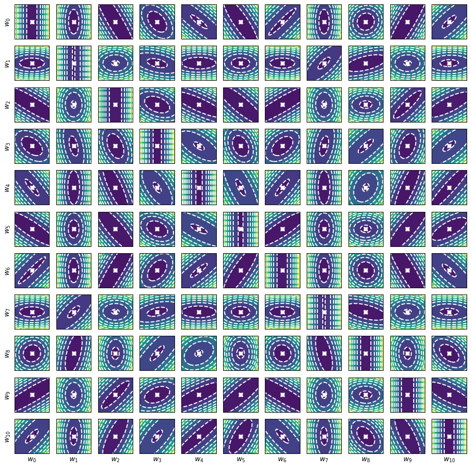

# libnlif
**A synaptic weight solver for multi-compartment LIF neurons**



*libnlif* is a fast weight solver for multi-compartment LIF neurons ("*n*-LIF") with conductance- or current-based synapses.
This Python-backed library supercedes and extends the stand-alone *[libbioneuronqp](https://github.com/astoeckel/libbioneuronqp)*.
The weight solver uses the [OSQP library](https://www.osqp.org/).
*libnlif* is written in a combination of C++ and Python; the C++ portions of the code are compiled automatically once the code is used for the first time.

## Installing and Dependencies

All compile-time dependencies, including `eigen` and `osqp` are contained in this repository.
Make sure to clone this repository using the `recursive` flag:
```sh
git clone --recursive https://github.com/astoeckel/libnlif
```

Simply use `pip3 install` to install the library (depending on your system, you may have to use `pip` instead of `pip3`)
```
cd libnlif
pip3 install --user -e .
```

To make sure that the library has been installed successfully, run
```
python3 -m libnlif.solver
```

## License

This software package is comprised of the actual library (`libbioneuronqp`), as well as its dependencies (`osqp`, `qdldl`, `SuiteSparse AMD`) located in the `extern/osqp` directory. The licenses of these software packages are reproduced below.

**libbioneuron ‒ Library solving for synaptic weights**  
Copyright (C) 2020  Andreas Stöckel

This program is free software: you can redistribute it and/or modify
it under the terms of the GNU Affero General Public License as
published by the Free Software Foundation, either version 3 of the
License, or (at your option) any later version.

**OSQP**  
Copyright (C) 2019 Bartolomeo Stellato, Goran Banjac, Paul Goulart, Stephen Boyd

Licensed under the Apache License, Version 2.0 (the "License");
you may not use this file except in compliance with the License.
You may obtain a copy of the License at http://www.apache.org/licenses/LICENSE-2.0

Unless required by applicable law or agreed to in writing, software
distributed under the License is distributed on an "AS IS" BASIS,
WITHOUT WARRANTIES OR CONDITIONS OF ANY KIND, either express or implied.
See the License for the specific language governing permissions and
limitations under the License.

**QDLDL**  
Copyright (C) 2019 Paul Goulart, Bartolomeo Stellato, Goran Banjac

Licensed under the Apache License, Version 2.0 (the "License");
you may not use this file except in compliance with the License.
You may obtain a copy of the License at http://www.apache.org/licenses/LICENSE-2.0

Unless required by applicable law or agreed to in writing, software
distributed under the License is distributed on an "AS IS" BASIS,
WITHOUT WARRANTIES OR CONDITIONS OF ANY KIND, either express or implied.
See the License for the specific language governing permissions and
limitations under the License.

**SuiteSparse AMD**  
Copyright (C) 1996-2016 Timothy A. Davis, Patrick R. Amestoy, and Iain S. Duff

Redistribution and use in source and binary forms, with or without
modification, are permitted provided that the following conditions are met:

* Redistributions of source code must retain the above copyright
 notice, this list of conditions and the following disclaimer.
* Redistributions in binary form must reproduce the above copyright
  notice, this list of conditions and the following disclaimer in the
  documentation and/or other materials provided with the distribution.
* Neither the name of the organizations to which the authors are
  affiliated, nor the names of its contributors may be used to endorse
  or promote products derived from this software without specific prior
  written permission.

THIS SOFTWARE IS PROVIDED BY THE COPYRIGHT HOLDERS AND CONTRIBUTORS "AS IS"
AND ANY EXPRESS OR IMPLIED WARRANTIES, INCLUDING, BUT NOT LIMITED TO, THE
IMPLIED WARRANTIES OF MERCHANTABILITY AND FITNESS FOR A PARTICULAR PURPOSE
ARE DISCLAIMED. IN NO EVENT SHALL THE COPYRIGHT HOLDERS BE LIABLE FOR ANY
DIRECT, INDIRECT, INCIDENTAL, SPECIAL, EXEMPLARY, OR CONSEQUENTIAL DAMAGES
(INCLUDING, BUT NOT LIMITED TO, PROCUREMENT OF SUBSTITUTE GOODS OR
SERVICES; LOSS OF USE, DATA, OR PROFITS; OR BUSINESS INTERRUPTION) HOWEVER
CAUSED AND ON ANY THEORY OF LIABILITY, WHETHER IN CONTRACT, STRICT
LIABILITY, OR TORT (INCLUDING NEGLIGENCE OR OTHERWISE) ARISING IN ANY WAY
OUT OF THE USE OF THIS SOFTWARE, EVEN IF ADVISED OF THE POSSIBILITY OF SUCH
DAMAGE.
